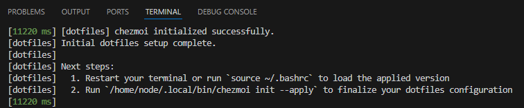

# Dotfiles

My personal configuration files, managed with [chezmoi](https://www.chezmoi.io/).

## Key Variables

The following variables are used in generating appropriate configurations for different environments and contexts:
- **Host type (`.host.type`)**: `native`, `wsl`, or `container` (for dev containers and possibly other containerized environments)
- **Host purpose (`.host.purpose`)**: `personal`, `work`, or `unknown`
- **Operating system (`.chezmoi.os`)**: Windows-specific settings when applicable
- **Hostname (`.chezmoi.hostname`)**: Special handling for specific machines (e.g., personal desktop with Git signing keys)

## Private VS Code Settings

For work environments, you can store private VS Code settings (such as API keys, tokens, or work-specific configurations) securely using [chezmoi's keyring integration](https://www.chezmoi.io/user-guide/password-managers/keychain-and-windows-credentials-manager/).

**Setup command**:
```bash
chezmoi secret keyring set --service "vscode" --user="work-settings"
```

**Value format**: Enter your settings as a one-line, comma-separated list of JSON key-value pairs:
```
"setting1": value1, "setting2": value2
```

These settings will be automatically included in your VS Code `settings.json` when `.host.purpose` is set to `work`.

## Dev Container Setup

### VS Code Settings

I use the following settings provided by the [VS Code Dev Containers extension](https://marketplace.visualstudio.com/items?itemName=ms-vscode-remote.remote-containers):

```json
{
    "dev.containers.copyGitConfig": false,
    "dotfiles.installCommand": "install-devcontainer.sh",
    "dotfiles.repository": "bijancamp/dotfiles",
    "dotfiles.targetPath": "~/.local/share/chezmoi"
}
```

These settings ensure that:
- The host's .gitconfig is not automatically copied into the container (we generate it within the container via a chezmoi template)
- This repository is cloned to the default chezmoi source path within the container
- The custom installation script is executed after the repo is cloned

### install-devcontainer.sh

Automates the initial setup of chezmoi and dotfiles within dev containers.



**What it does**:
- Installs chezmoi
- Initializes chezmoi for containers with purpose "unknown"
- Applies dotfiles

**Usage**: This script is automatically executed by VS Code when creating dev containers (via the `dotfiles.installCommand` setting). Run `chezmoi init --apply` after the container has finished starting to reapply the dotfiles with the necessary purpose.
